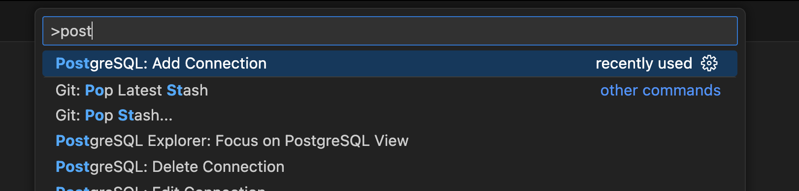
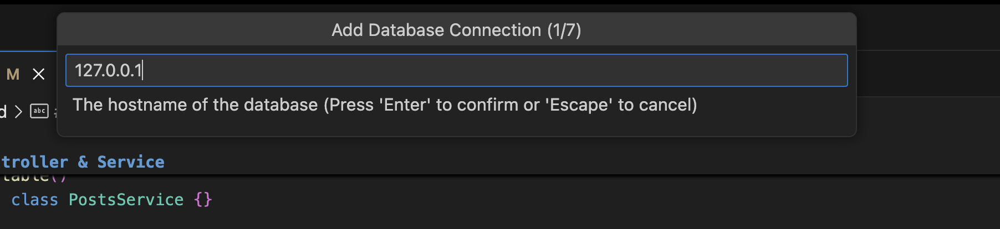
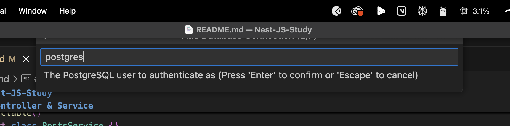

# Nest-JS-Study

NestJS 공부!

## NestJS Built-in-Exception

```js
BadRequestException;
UnauthorizedException;
NotFoundException;
ForbiddenException;
NotAcceptableException;
RequestTimeoutException;
ConflictException;
GoneException;
HttpVersionNotSupportedException;
PayloadTooLargeException;
UnsupportedMediaTypeException;
UnprocessableEntityException;
InternalServerErrorException;
NotImplementedException;
ImATeapotException;
MethodNotAllowedException;
BadGatewayException;
ServiceUnavailableException;
GatewayTimeoutException;
PreconditionFailedException;
```

## Controller & Service

**controller** : 가장 맨 앞에서 요청을 받는 역할. 대응하는 함수(Service)로 라우팅 시켜준다<br>
**service** : 로직 처리.

```js
export class PostsController {
  constructor(private readonly postsService: PostsService) {}
```

Controller는 생성자에서 Service를 의존성 주입받는다!

```js
@Injectable()
export class PostsService {}
```

IOC콘테이너에 Injectable로 Service를 등록하는거같은데,
Flutter의 getIt, Injectable도 유사한 패턴을 사용한것이라고 바로 캐치했음!

## Docker

```bash
docker compose up
```

docker-compose.yaml에 저장된 내용대로 연결진행




port : 5432 -> Standard connection > postgres > 연결이름:nestjs_local_database
