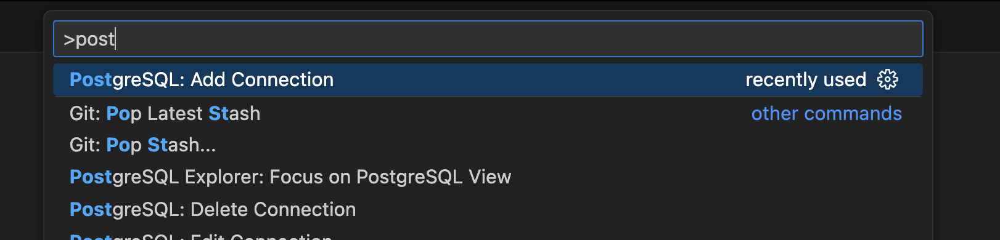
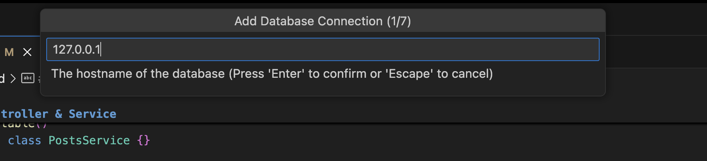
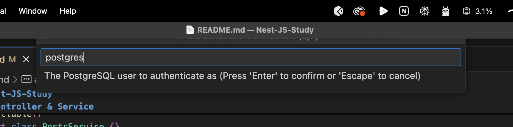

# Nest-JS-Study

NestJS 공부!
공부 목적 :
1) 서버와 클라이언트 모두 만족스러운 데이터 설계 경험
2) 서버 예외처리 경험
3) WebSocket 서버단 경험


## NestJS 프로젝트 생성

```bash
nest new {project name}
```

## NestJS Built-in-Exception

```js
BadRequestException;
UnauthorizedException;
NotFoundException;
ForbiddenException;
NotAcceptableException;
RequestTimeoutException;
ConflictException;
GoneException;
HttpVersionNotSupportedException;
PayloadTooLargeException;
UnsupportedMediaTypeException;
UnprocessableEntityException;
InternalServerErrorException;
NotImplementedException;
ImATeapotException;
MethodNotAllowedException;
BadGatewayException;
ServiceUnavailableException;
GatewayTimeoutException;
PreconditionFailedException;
```

## Controller & Service

**controller** : 가장 맨 앞에서 요청을 받는 역할. 대응하는 함수(Service)로 라우팅 시켜준다<br>
**service** : 로직 처리.

```js
export class PostsController {
  constructor(private readonly postsService: PostsService) {}
```

Controller는 생성자에서 Service를 의존성 주입받는다!

```js
@Injectable()
export class PostsService {}
```

IOC콘테이너에 Injectable로 Service를 등록하는거같은데,
Flutter의 getIt, Injectable도 유사한 패턴을 사용한것이라고 바로 캐치했음!

## Docker

```bash
docker compose up
```

docker-compose.yaml에 저장된 내용대로 연결진행




port : 5432 -> Standard connection > postgres > 연결이름:nestjs_local_database

## TypeORM 설치

### 패키지 설치

```bash
npm add @nestjs/typeorm typrorm pg --save
```

### 앱 모듈에 데이터 베이스 정보 입력

```js
@Module({
  imports: [
    PostsModule,
    TypeOrmModule.forRoot({
      type: 'postgres', // 데이터베이스 타입,
      host: '127.0.0.1',
      port: 5432, // 데이터베이스 포트
      username: 'postgres', // 데이터베이스 사용자명
      password: 'postgres', // 데이터베이스 비밀번호
      database: 'postgres', // 데이터베이스 이름
      entities: [PostsModel], /// 사용하는 모델들이 추가될때마다 넣어주기
      synchronize: true, // 개발 환경에서만 사용, 프로덕션에서는 false로 설정
    }),
  ],
  controllers: [AppController],
  providers: [AppService],
})
```

## Repository 의존성 주입

```js
@Injectable()
export class PostsService {
  constructor(
    @InjectRepository(PostsModel)
    private readonly postsRepository: Repository<PostModel>,
  ) {
    this.postsRepository = postsRepository;
  }
  getAllPosts(): PostModel[] {
    return posts;
  }
  ...
  }
```

## 조회 / 생성 / 수정

**테이블 전체 조회**

```js
return this.postsRepository.find();
```

**단건 조회**

```js
const post: PostModel | null = await this.postsRepository.findOne({
  where: { id },
});
```

**생성**

```js
const post = this.postsRepository.create({
  author,
  title,
  content,
  likeCount: 0, // 초기값 설정
  commentCount: 0, // 초기값 설정
});
```

**저장**
save의 기능

1.  만약에 id기준으로 데이터가 존재하지 않는다면 새로 생성
2.  만약에 id기준으로 데이터가 존재한다면 해당 데이터를 수정

```js
const newPost = await this.postsRepository.save(post);
```

## Flutter로 로컬호스트 DataFetching 성공


## TypeORM Column 파라미터

```js
/// ID
  ///  @PrimaryGeneratedColumn()
  /// 자동으로 생성되는 ID

  /// @PrimaryColumn()
  /// 수동으로 설정하는 Primary Key

  /// @PrimaryGeneratedColumn('uuid')
  /// UUID 형식의 자동 생성 ID
  /// PrimaryGeneratedColumn -> 1,2,3, ... 순차적으로 생성
  /// uuid를 파라미터로 주면 UUID 형식으로 생성
  /// ex) 123e4567-e89b-12d3-a456-426614174000 : string
  @PrimaryGeneratedColumn('uuid')
  id: string;

  /// 제목
  @Column({
    /// 데이터 베이스 인지하는 카럼 타입
    /// 자동으로 유추됨
    type: 'varchar',
    ///  데이터베이스 칼럼 이름
    /// 프로퍼티 이름으로 자동 유추됨
    name: 'title',

    /// 입력할 수 있는 글자 길이
    length: 300,

    /// null 가능 여부
    nullable: true,

    // 업데이트 가능 여부
    /// false인 경우 이후에는 수정할 수 없음
    /// typeorm 0.3.20에서 에러 발생중
    update: false,

    /// find()를 살행할때, 기본으로 값을 불러올지
    /// 기본값이 true
    /// false인 경우, find()를 실행할 때 title 값이 불러오지 않음
    /// 가져오고 싶은 경우 find({select : {title : true}})
    select: true,

    ///기본값
    /// 아무것도 입력안했을때 생성되는 값
    default: 'default title',

    /// 칼럼중에서 유일무이한 값이어야 하는지
    unique: true,
  })
  title: string;

```

## Enum Type

다음 처럼 Enum클래스를 선언하고

```ts
export enum Role {
  USER = "user",
  ADMIN = "admin",
}
```

Column에 적용시킬 수 있다!

```ts
  /// 역할
  @Column({
    type: 'enum',
    enum: Role,
    default: Role.USER,
  })
  role: Role;
```

## Entity Embedding

```ts
export class Name {
  @Column()
  first: string;

  @Column()
  last: string;
}

@Entity()
export class StudentModel {
  @PrimaryGeneratedColumn()
  id: number;

  @Column(() => Name)
  name: Name; // -> nameFirst, nameLast Column생성

  @Column()
  class: string;
}

@Entity()
export class TeacherModel {
  @PrimaryGeneratedColumn()
  id: number;

  @Column(() => Name)
  name: Name; // -> nameFirst, nameLast Column생성
  @Column()
  salary: number;
}
```

## TableInheritance

```ts
@Entity()
@TableInheritance({
  column: {
    name: "type",
    type: "varchar",
  },
})
export class SingleBaseModel {
  @PrimaryGeneratedColumn()
  id: number;

  @CreateDateColumn()
  createdAt: Date;

  @UpdateDateColumn()
  updatedAt: Date;
}

@ChildEntity()
export class ComputerModel extends SingleBaseModel {
  @Column()
  brand: string;
}
@ChildEntity()
export class AirplaneModel extends SingleBaseModel {
  @Column()
  country: string;
}
```

요렇게 만들어주면 Table은 아래처럼 만들어진다.
SingleBaseModel Table

- id
- createdAt
- updatedAt
- type
- brand
- country
